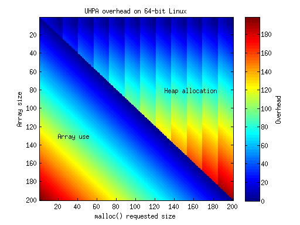
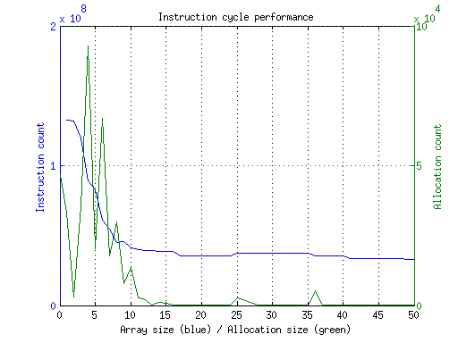
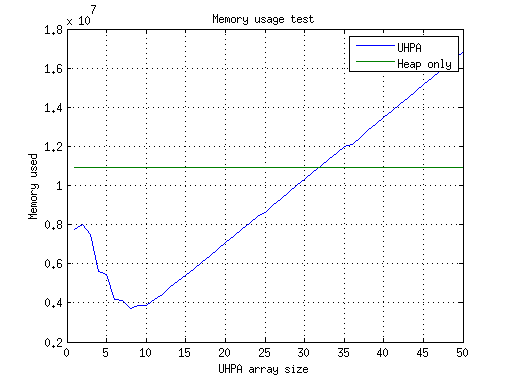

This is "Union of heap pointer and array"
=========================================

This set of macros is intended to provide a simple means of treating a
variable as a heap pointer or a fixed size array, depending on the size of
the data being stored. It was borne out of the situation where the majority
of calls to malloc for a struct member were ending up less than 8 bytes -
i.e. the size of the 64-bit pointer. By using uhpa a great number of calls
to malloc could be avoided. The downsize to this method is that you must
always know the length of data that you are dealing with.

The data structure you provide must look something like:

    typedef union {
	    void *ptr;
	    char array[MAX_ARRAY_SIZE];
    } uhpa_u

This code really only makes sense if the data types you want to store are
smaller than a pointer - the most obvious choice being bytes. All of these
functions assume that the array is made up of single bytes.

You can change the type of ptr to match your needs, with the above caveat
about array. So make ptr a `char*`, `uint8_t*`, `unsigned char*`, ...

It should be possible to modify the code to work with arrays that have
element sizes bigger than a byte.

Define `MAX_ARRAY_SIZE` to be as large as you want, depending on the size of
your commonly used data. Define `MAX_ARRAY_SIZE` to be `sizeof(void *)` if you
do not want to "waste" any memory per item - with the tradeoff that calls to
malloc will be more frequent because `MAX_ARRAY_SIZE` will only be 4 or 8
bytes, depending on your architecture.

Choosing the array size
-----------------------

There are three options for choosing the array size:

* `== sizeof(void *)` : no overhead with either array or heap usage.
* `< sizeof(void *)` : basically pointless, guaranteed memory overhead when using array.
* `> sizeof(void *)` : memory overhead will occur when using heap allocation.

The latter choice is the most interesting to consider. Increasing the size of
the array will reduce calls to malloc because more cases of memory usage will
be covered by the array, but when a request exceeds the available memory in the
array then space is wasted. For example, if the array size is set to 10 and
sizeof(void\*) is 8, then the UHPA data type will be 10 bytes long and so
requests of up to 10 bytes will use the array. A request of 11 bytes will
require heap allocation and so the UHPA data type will be treated as a pointer.
This means that of the 10 bytes of UHPA data type, only 8 will actually be in
use, as the pointer. The remaining 2 bytes are overhead. Using a longer array
size exacerbates this problem.

The per allocation overhead associated with using UHPA on a 64-bit Linux system
is shown in the image below, for varying `MAX_ARRAY_SIZE` and requested memory
sizes. The bottom left quadrant shows the region of memory used as an array,
and the top right shows the region when heap memory allocation is required.

Profiling example
-----------------

The profile directory contains a program that attempts to allow you to carry
out crude profiling of UHPA using e.g. callgrind. It also contains some example
data which is an array of sizes of data to be allocated. This data was
collected from the mosquitto broker instance running at test.mosquitto.org,
then placed in random order. If you wish to use UHPA for your own use, getting
your own data is recommended.

The image below shows the result of compiling this program with array size from
1-50, then running the result through callgrind and recording the instruction
count. For reference, it also includes a histogram of the data lengths used
when allocating. The instruction count drops rapidly for even small array
sizes, then hits a plateau. It is clear that in this example the length of data
used has a strong influence.  

The image below shows a plot of the expected total memory used for the same
test for different UHPA array sizes, and a plot of the expected total memory
used if only heap allocation is used, both based on a current Linux 64-bit architecture.

Taking the results from both plots, if minimising memory usage is the aim then
selecting a UHPA array size of 8 bytes is best. If saving instruction cycles is
more important then a UHPA array size of 16 bytes gives better performance
whilst only incurring a small memory penalty compared to 8 bytes. Choosing a
large array size of 50 bytes gives the lowest instruction count in this
example, but does so at the expense of around 50% increase in memory usage for
only a fractional improvement in instruction count.

Core Functions
--------------

Note that if you are using strings, set size to be strlen(s)+1, so that the
null terminator is included, or use the `_STR` functions below.

### UHPA_ALLOC(u, size)

Call to allocate memory to a uhpa variable if required.

* u : the uhpa data type that will have memory allocated or not, depending on "size".
* size : the length of the data to be stored, in bytes.

returns :
* 1 if memory was allocated successfully
* 0 if memory was not able to be allocated
* -1 if no memory needed to be allocated

### UHPA_ACCESS(u, size)

Call to access (for read or write) a uhpa variable that has already had `UHPA_ALLOC()` called on it.

* u : the uhpa data type that has already had memory allocated.
* size : the length of the stored data, in bytes.

returns : an appropriate pointer/array address

### UHPA_FREE(u, size)

Call to free memory associated with a uhpa variable. This is safe to
call with a data structure that does not have heap allocated memory.

* u : the uhpa data type that has already had memory allocated.
* size : the length of the stored data, in bytes.
	
String Functions
----------------

Convenience functions when working with strings. These are identical to the
non-string versions, except that they increase the value of "size" by 1, to
take into account the need for storing the 0 termination character.

    UHPA_ALLOC_STR(u, size)
    UHPA_ACCESS_STR(u, size)
    UHPA_FREE_STR(u, size)
	
Memory Functions
----------------

If you wish to use your own memory functions for alloc/free, #define both
`uhpa_malloc` and `uhpa_free` to your own functions.

